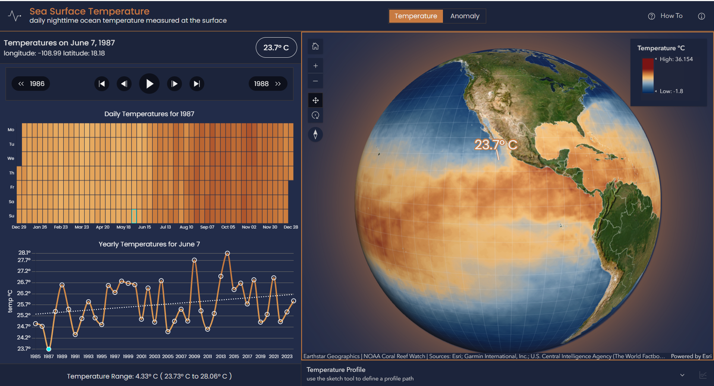

# Sea Surface Temperature

With this web applications you can visualize and find patterns in the global nighttime sea surface temperature for the past 40 years.

[View it live](https://geoxc-apps2.bd.esri.com/LivingAtlas/SeaSurfaceTemperature/index.html)

The application is built with [ArcGIS Maps SDK for JavaScript](https://developers.arcgis.com/javascript/latest/api-reference/), in particular the time-enabled [ImageryLayer](https://developers.arcgis.com/javascript/latest/api-reference/esri-layers-ImageryLayer.html). Living Atlas imagery services used in the application:

- [Sea Surface Temperature](https://www.arcgis.com/home/item.html?id=100a26c4d15445ffadab0d04e536b9c1)

[Original dataset](https://coralreefwatch.noaa.gov/product/5km/index_5km_sst.php) - The NOAA Coral Reef Watch (CRW) daily global 5km Sea Surface Temperature (SST) product, also known as CoralTemp, shows the nighttime ocean temperature measured at the surface. The SST scale ranges from -2 to 35°C. The CoralTemp SST data product was developed from two, related reanalysis (reprocessed) SST products and a near real-time SST product. Spanning January 1, 1985 to the present, the CoralTemp SST is one of the best and most internally consistent daily global 5km SST products available.

- [Sea Surface Temperature Anomaly](https://www.arcgis.com/home/item.html?id=fa166ee5a22e449bba49a3315263af69)

[Original dataset](https://coralreefwatch.noaa.gov/product/5km/index_5km_ssta.php) - The NOAA Coral Reef Watch (CRW) daily global 5km Sea Surface Temperature (SST) Anomaly product displays the difference between today's SST and the long-term average. The scale ranges from -5 to +5°C. Positive values mean the temperature measured is warmer than average; negative values mean cooler than average.

The UI is created using [Calcite Components](https://developers.arcgis.com/calcite-design-system/components/).

## Features

- Visualize daily sea surface temperature and anomaly values on a globe.
- A heatmap chart for temperature/anomaly values for the whole year for a location.
- A line chart for the yearly values for that day and that location.

## Instructions

This demo is built as a _static_ web application. To run it in a browser, clone or download this repository and copy the root folder to a web server.

## Contributing

Esri welcomes contributions from anyone and everyone. Please see our [guidelines for contributing](https://github.com/esri/contributing).

## Licensing

Copyright 2024 Esri

Licensed under the Apache License, Version 2.0 (the "License");
you may not use this file except in compliance with the License.
You may obtain a copy of the License at

http://www.apache.org/licenses/LICENSE-2.0

Unless required by applicable law or agreed to in writing, software
distributed under the License is distributed on an "AS IS" BASIS,
WITHOUT WARRANTIES OR CONDITIONS OF ANY KIND, either express or implied.
See the License for the specific language governing permissions and
limitations under the License.

A copy of the license is available in the repository's [license.txt](./LICENSE.txt) file.

## Contact

Application created by John Grayson and maintained by [Raluca Nicola](rnicola@esri.com) \
For more demos see: [Application Prototype Lab](https://apl.esri.com/)
